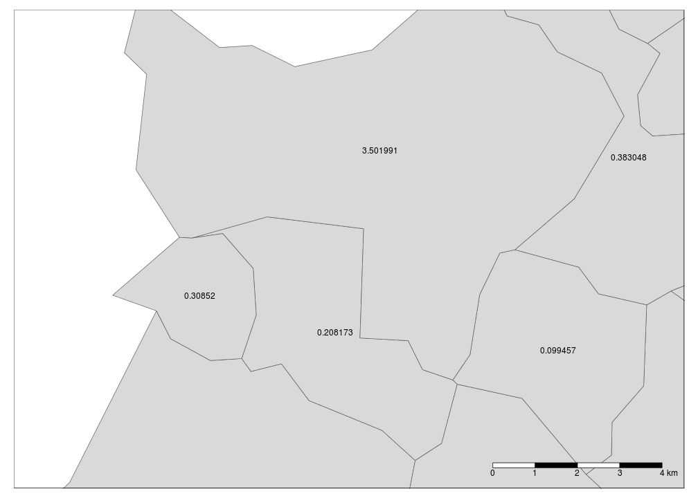
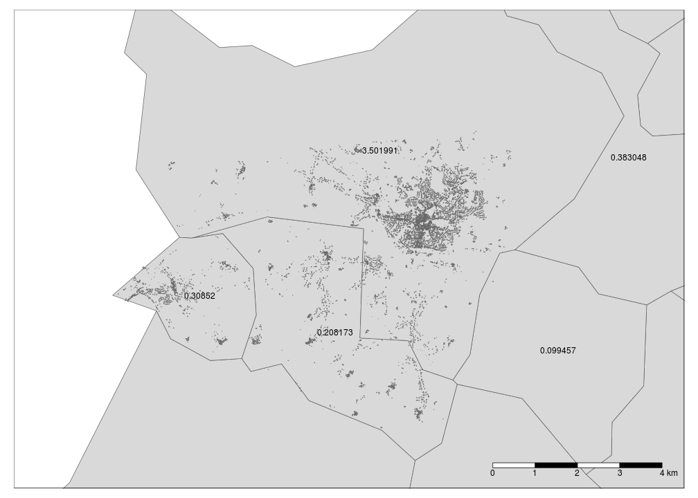
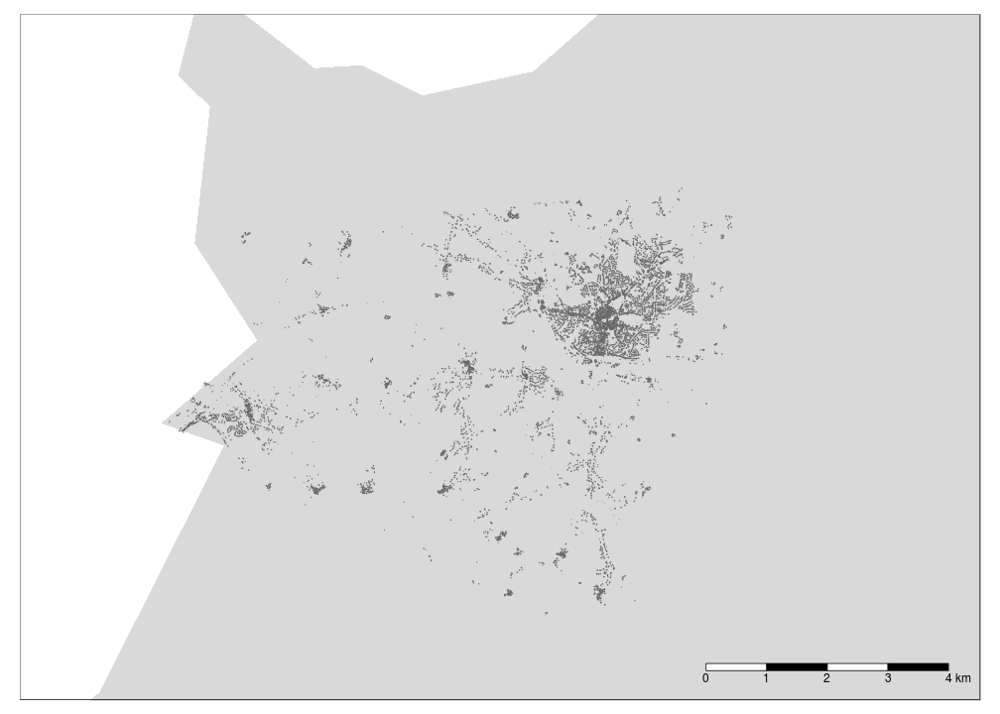
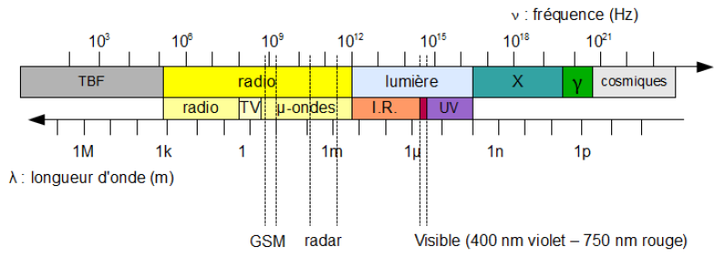
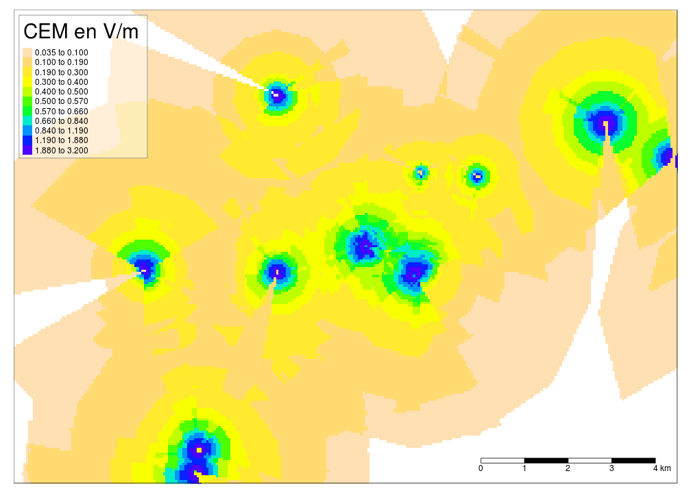
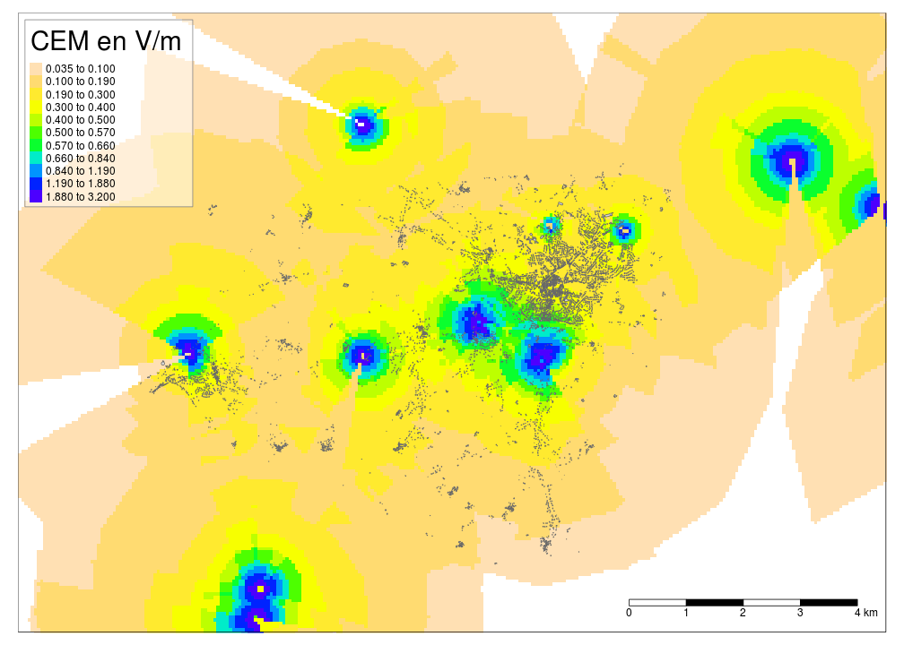
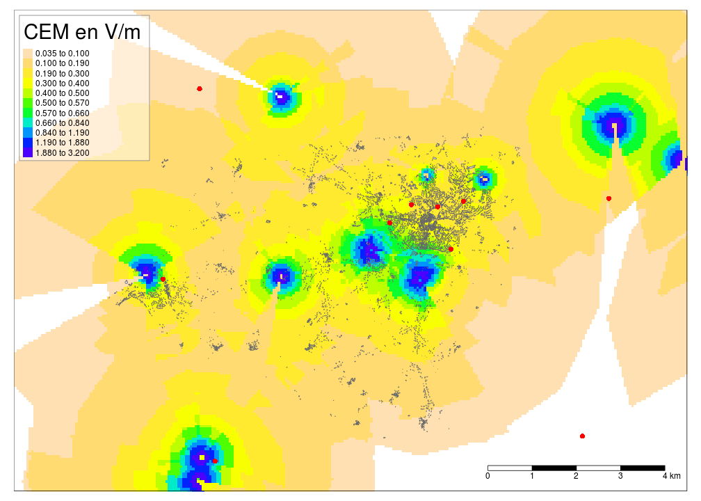
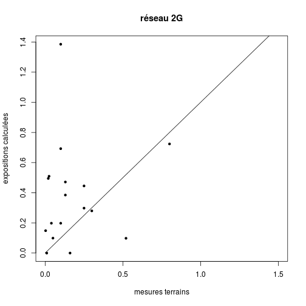
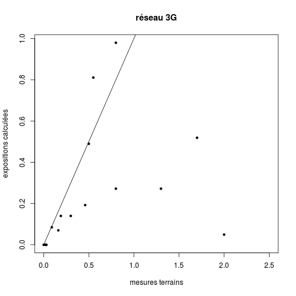

Champ électromagnétique et SLA
========================================================
author: F.Boumedienne, JP.Leleu
date: 2016
width: 1100
height: 700
autosize: true
INSERM, UMR 1094, Neuroépidémiologie Tropicale

========================================================
incremental:true
type: prompt

## Question

- existe t'il une relation entre **CEM** (Champ électromagnétique) produit par les antennes relais de téléphonie mobile et la survenue de cas de **SLA** (Sclérose latérale amyotrophique)

## Type d'étude

- étude d'incidence écologique et rétrospective.
- exposition résidentielle aux CEM des antennes GSM et l'incidence des SLA.

Materiel
========================================================
incremental:true
type: prompt
1. Cas de SLA survenus en région Limousin entre 2000 et 2012.
2. Recensement de la population.
3. Cartographie du bâti.
4. Implentation des antennes GSM.

Méthode
========================================================
incremental:true
type: prompt

1. Cas de SLA géo-réferencés à l'adresse au moment du diagnostic -> fichier shp

2. Nombre de cas attendus
  + calculé au niveau communal.
  + taux de réferences interne.
  + répartition des cas attendus selon le bâti (proportionnel à la
surface).<small>[carte](carte1.html)</small>

Méthode
===========================================================
title: false
type: prompt
transition: none

Méthode
===========================================================
title: false
type: prompt
transition: none

Méthode
===========================================================
title: false
type: prompt
transition: none

Spectre électromagnétique
===========================================================
type: prompt

Modélisation de l'exposition
============================================================
type: prompt
incremental:true

1. Découpage de la zone d'étude en cellules de 50m de coté.
2. Pour chaque cellule on estime l'exposition selon :
  + la distance aux antennes: inversement proportionnel à la distance $V/m=\sqrt{30.PIRE}/d$. (V/m en volt/mètre et PIRE en watt).
  + la direction d'emission.
  + champ d'ouverture (120°)
  + la superposition des expositions selon la somme quadratique $E_{total}=\sqrt{E^{2}_{1}+E^{2}_{2}+...E^{2}_{n}}$
  + La puissance d'émission (PIRE) 2G :1000w, 3G : 500w en
milieu rural et 2G : 500w et 3G : 250w en milieu urbain

Exposition
============================================================
title: false
type: prompt
transition: none

Exposition
============================================================
title: false
type: prompt
transition: none

Exposition
============================================================
title: false
type: prompt
transition: none

Validation de l'exposition par des mesures
============================================================
type: prompt
incremental:true

1. mesures réalisées sur le térrain.
2. Appareil HF59B (mesures entre 800MHz-2.5GHz, mode pulsé
ou non)
3. Antenne omnidirectionnelle
4. Couplés à des relevés GPS.
5. Mesures en champ libre et lointain.

Résultats des mesures
===========================================================
type: prompt
incremental:true

***

GSM
============================================================
title: false
type: prompt

<iframe src="resGSM/resGSM.html" width="1100px" height="700px"></iframe>

G2
============================================================
title: false
type: prompt

<iframe src="resG2/res2G.html" width="1100px" height="700px"></iframe>

G3
============================================================
title: false
type: prompt

<iframe src="resG3/res3G.html" width="1100px" height="700px"></iframe>

GSMT
============================================================
title: false
type: prompt

<iframe src="resGSMT/resGSMT.html" width="1100px" height="700px"></iframe>

G2T
============================================================
title: false
type: prompt

<iframe src="resG2T/resG2T.html" width="1100px" height="700px"></iframe>

G3T
============================================================
title: false
type: prompt

<iframe src="resG3T/resG3T.html" width="1100px" height="700px"></iframe>

Periodes d'étude
============================================================
title: false
type: prompt

<iframe src="periode/periode_etude.html" width="1100px" height="700px"></iframe>

